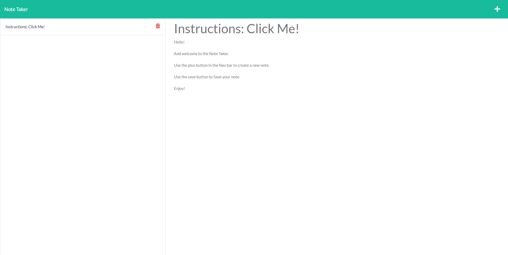

# ExpressToDo
This project is part of the GTPE Coding Bootcamp and requires the creation of a to do list using node and express

## Table of Contents
* [Description](#description)
* [Installation](#installation)
* [Usage](#usage)
  * [License](#license) 
* [Contributing](#contributing)
* [Tests](#tests)
* [Questions](#questions)

----

## Description
This project was assigned as part of the GTPE Coding Bootcamp to create a web application for creatingand storing notes using express routes. This proejct is live on heroku.

----

## Installation
This project requires the installation of node. copy the file "server.js" and all folders from this repo into the desired directory.

----

## Usage
To use this locally, 
* run "npm init" 
* run "npm install express" 
* run "npm install fs"  
* run "npm install uuid"

This file project is dependent on node.js, express.js, fs.js, uuid.js and the provided files ( in the prearranged directories). 

After the required install, simpley run "node server.js" in the command line and click on the link to the local browser application.

[Go to the Repo](https://github.com/BerlicTheHunter/ExpressToDo)

[Go To Live Page on Heroku](https://enigmatic-peak-71410.herokuapp.com/)

## License
This project is licensed under MIT License and can be found [here](./LICENSE)

----

## Contributing
This project is not accepting contributions at this time

----

## Tests
Tests for each employee class are included and can be run using
"npm test"

----

## Questions
For any other questions, please the the provided links below
* [Github](https://github.com/BerlicTheHunter)
* [Email](mailto:bsorrell3@gmail.com)
